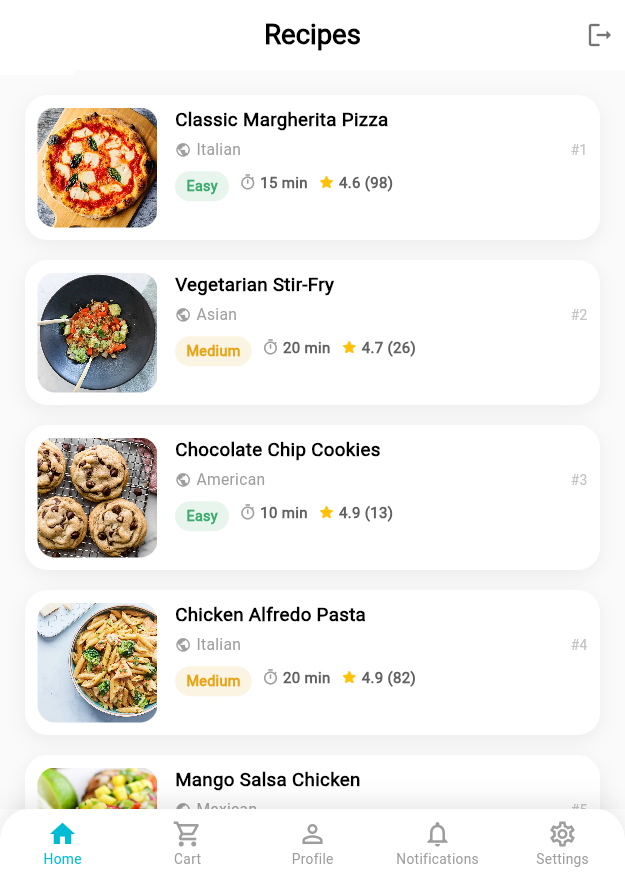
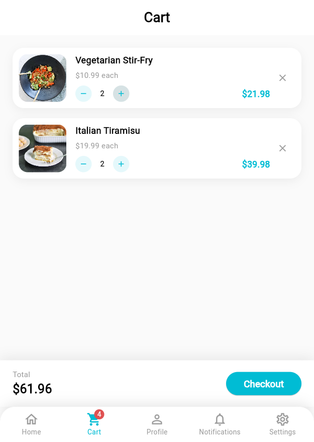
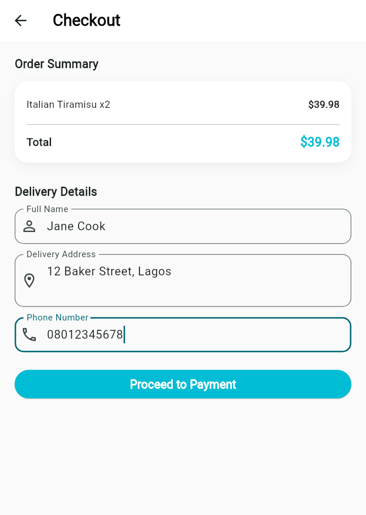
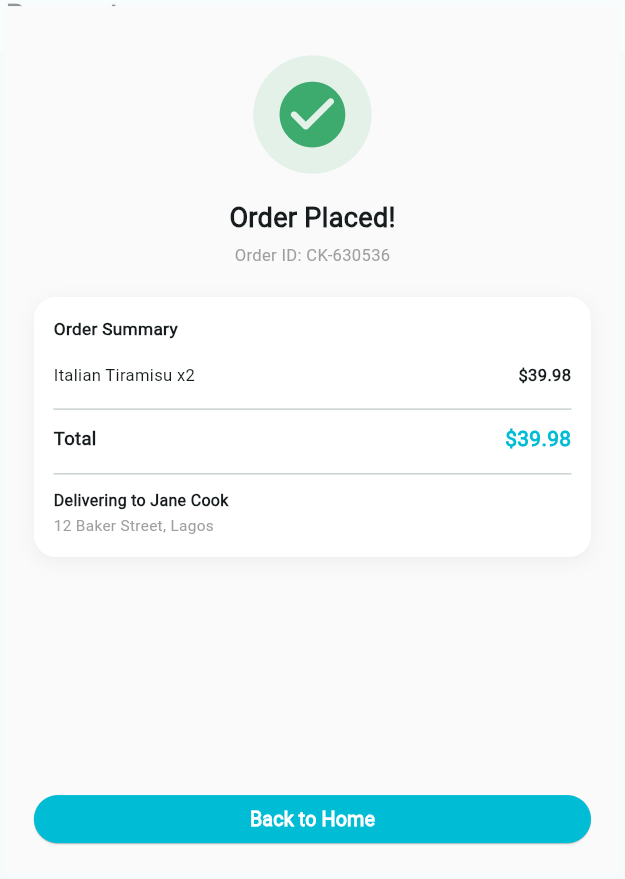

# Cookiee

A Flutter recipe app built with GetX: Splash → Onboarding → Auth → Home → Recipe Detail → Cart →
Checkout → Payment → Success, with live recipe data pulled from
[dummyjson.com/recipes](https://dummyjson.com/recipes). The Profile tab supports editing and
locally persisting a full profile (photo, name, email, phone, date of birth, gender, bio) via
`shared_preferences`.

Recipes have no price in the source API, so each recipe carries a small deterministic mock price
(stable per recipe `id`, not random) purely so cart totals and checkout mean something — this is a
mock-payment flow, not a real store.

## Getting Started

```bash
flutter pub get
flutter run
```

## UI Design Choice

Each recipe is a horizontal list tile (image left, details right) rather than a grid, so a user
can scan name, cuisine, difficulty, cook time, and rating in one glance per row without excessive
scrolling. Difficulty badges are color-coded (green/amber/red) for instant visual triage instead of
reading text. The cyan accent and rounded-pill shapes carry over from the existing Auth screens to
keep one consistent visual language across the whole app.

The profile view uses the same card language as the rest of the app: a large avatar with an
overlaid edit badge up top, then a single grouped card listing each field with an icon, label, and
value, so it reads like a settings/info sheet rather than a form even when you're just viewing it.
Editing is a separate screen reached via "Edit Profile" — keeping view and edit modes visually
distinct avoids accidentally-editable-looking read-only text.

Cart and Checkout follow the same card-on-neutral-background language as the rest of the app, with
one addition: a summary bar pinned to the bottom of the Cart screen (running total + Checkout
button) so the total is always visible without scrolling, mirroring the "Add to Cart" bar already
used on the Recipe Detail screen. The Checkout button is visibly disabled (grey) until the delivery
form validates, so it's clear *why* you can't proceed instead of just failing silently on tap.
Payment and Success are deliberately sparse, single-purpose screens — nothing to interact with
except "Pay Now" and "Back to Home" — since they're transient steps in a linear flow, not places
meant to invite browsing.

## Screenshots

### Home



### Profile


### Cart



### Checkout



### Success

